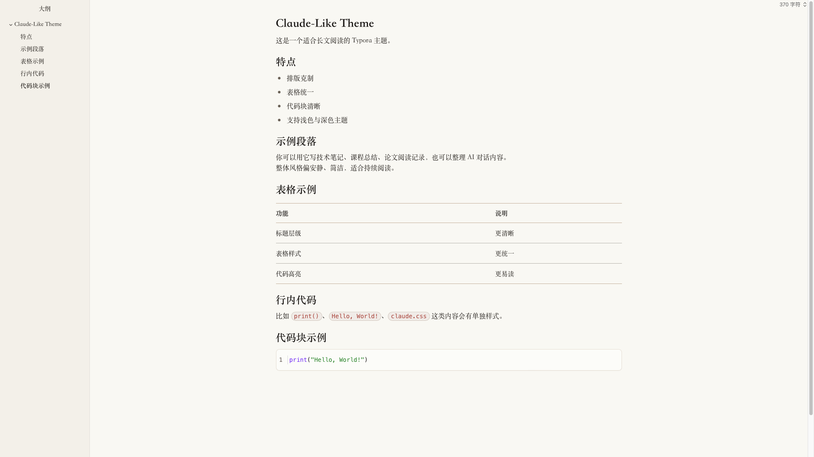
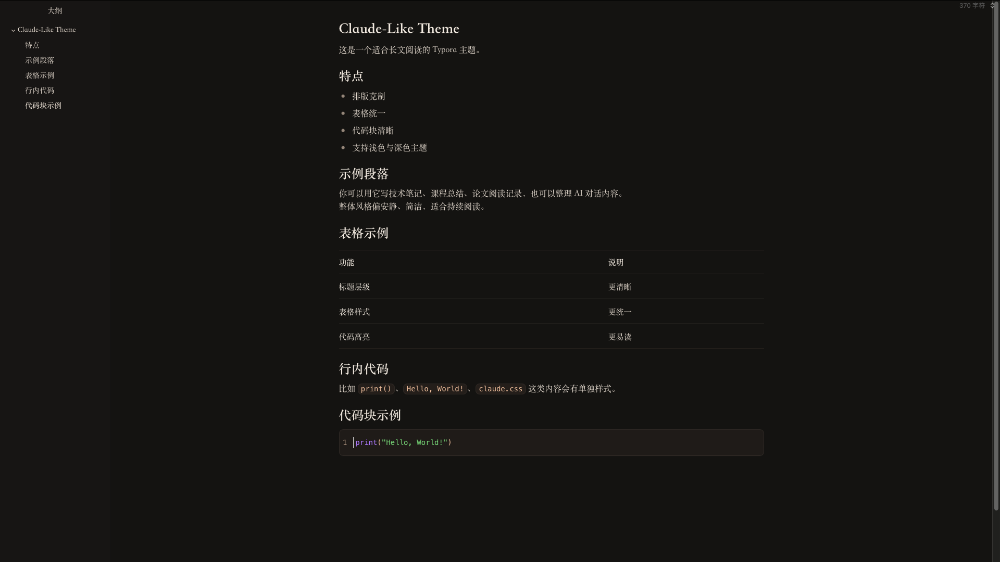

# Claudy Theme

一个以 Claude-like 阅读体验为灵感、并针对中文写作重新打磨的 Typora 主题。现提供浅色、深色两个版本。

> [English Version Below](#english-version)

一个以 Claude-like 阅读体验为灵感、并针对中文写作重新打磨的 Typora 主题。现提供浅色、深色两个版本。

## 安装方式

也可以直接从 GitHub 的 Releases 页面下载最新主题文件。

1. 打开 Typora。
2. 进入 `设置 / 偏好设置 -> 外观 -> 打开主题文件夹`。
3. 将以下文件复制到主题目录中：

   - `claudy.css`
   - `claudy-dark.css`
4. 重启 Typora。
5. 在主题菜单中选择：

   - `Claudy`
   - `Claudy Dark`

> **推荐设置（Windows）**：进入 `偏好设置 -> 外观`，将**窗口样式**设为**一体化**（重启 Typora 后生效），主题在 Windows 一体化模式下显示效果最佳。

它不是简单地把网页样式搬进 Typora，而是保留了 Claude-like 那种安静、克制、长文友好的阅读气质，同时针对中文内容、表格、代码块、导出效果做了重新调校。

## 设计目标

- 让长文阅读更稳定，不抢内容本身的注意力。
- 让中文标题、正文、强调文本之间的层级更清楚。
- 让技术文档里最常见的表格、代码块、行内代码保持统一风格。
- 同时提供浅色、深色两个版本，减少切换场景时的割裂感。

## 主题特点

### 1. Claude-like 风格的整体阅读气质

主题整体采用低饱和、轻对比、较宽松的留白节奏，适合：

- 技术笔记
- 课程总结
- 论文阅读记录
- AI 对话整理
- 中英文混排说明文档

相比更“设计感驱动”的 Typora 主题，这套样式更强调稳定性、可读性和连续阅读体验。

### 2. 针对中文优化的字体方案

为了让中文观感更接近实际阅读材料，而不是浏览器默认排版，主题将正文、标题、强调文本、代码分别处理：

- 正文以更适合长文阅读的中文字体为主。
- 标题和强调文本采用更清晰的字族，增强层级。
- 代码区域使用独立的等宽字体栈，保证字符对齐与辨识度。

这样的处理在中文文档里会比纯英文网页字体迁移更自然。

### 3. 统一过的表格系统

表格是技术文档里最容易失控的部分，所以这套主题专门统一了：

- 表头与正文的字体层级
- 横向分隔线强弱
- 单元格内边距
- 中英文混排时的节奏
- 明暗主题下的视觉一致性

它适合展示：

- 对比表
- 参数表
- 实验结果表
- 概念说明表

### 4. 更接近日常技术写作的代码样式

代码部分分成两类处理：

- 行内代码：更像轻量提示标签，适合突出变量名、函数名、命令名。
- 代码块：保留独立背景、边框、语言标签与语法高亮。

当前代码块高亮重点做了这些区分：

- 关键词 / 内建函数：紫色系
- 字符串：绿色系
- 注释与行号：灰色系
- 默认代码文本：深色中性文字

这样既不会像 IDE 那样过度鲜艳，也不会因为过于克制而失去可读性。

### 5. 两套主题同步维护

项目包含：

- `claudy.css`：浅色
- `claudy-dark.css`：深色

两套主题不是简单的亮度反转，而是在以下部分分别做了独立调整：

- 背景与文本对比
- 表格边框强度
- 代码块背景与高亮色
- 侧栏 / 菜单 / 编辑界面过渡

两套主题沿用同一套版心、字体与代码高亮逻辑，切换时不会产生阅读断层。

## 适用场景

这套主题尤其适合下面几类内容：

- 需要持续阅读的长篇 Markdown 文档
- AI 对话整理与二次编辑
- 面向中文读者的技术讲义
- 带有大量表格和代码块的说明文档
- 希望导出 PDF 时仍保持稳定版式的内容

如果你更偏好高装饰、强品牌感、或者非常夸张的标题视觉，这套主题可能不是最激进的选择；但如果你希望文档“看起来像认真整理过”，它会更合适。

## 文件说明

- `claudy.css`：浅色主题
- `claudy-dark.css`：深色主题

## 已优化的细节

- 中文正文排版节奏
- 标题层级清晰度
- 粗体强调识别度
- 行内代码胶囊样式
- 代码块语法高亮
- 表格边框与间距统一
- Typora 编辑界面与导出风格一致性

## 后续可继续扩展的方向

- 补充更多导出场景截图
- 为引用块、数学公式、任务列表继续细化细节
- 增加更偏论文风格或更偏博客风格的变体

## 总结

Claudy Theme 的核心不是“看起来像某个网页”，而是把那种安静、可信、适合长时间阅读的气质带进 Typora，并把它真正做成一套适合中文 Markdown 写作的主题。

如果你的文档里经常同时出现标题、表格、代码块和长段说明文本，这套主题会比较适合你。

## 协议

本项目基于 MIT 协议开源，详见根目录 [LICENSE](LICENSE) 文件。

## 商标说明

Claude 是 Anthropic, PBC 的商标。本项目与 Anthropic 无任何关联，也未获其官方授权或认可。主题名称中的「Claude-like」仅指其视觉气质上的灵感来源，不代表任何官方产品或品牌关系。

---

``

# Claudy Theme

A Typora theme inspired by a Claude-like reading experience, refined for Chinese writing and technical Markdown workflows. It ships in two variants: light and dark.

## Installation

You can also download the latest theme files directly from the GitHub Releases page.

1. Open Typora.
2. Go to `Preferences -> Appearance -> Open Theme Folder`.
3. Copy the following files into the theme folder:

   - `claudy.css`
   - `claudy-dark.css`
4. Restart Typora.
5. Choose one of the following from the Theme menu:

   - `Claudy`
   - `Claudy Dark`

> **Recommended setting (Windows)**: Go to `Preferences -> Appearance` and set **Window Style** to **Unibody** (restart Typora to apply). The theme is optimized for Unibody mode on Windows.

It is not a direct clone of a webpage. Instead, it keeps the calm, restrained, long-form reading atmosphere associated with a Claude-like style, while reworking typography, tables, code blocks, and export behavior for practical Markdown use.

## Design Goals

- Make long-form reading feel stable and low-noise.
- Improve hierarchy between headings, body text, and emphasis in Chinese documents.
- Keep tables, fenced code blocks, and inline code visually consistent.
- Maintain a coherent experience across light and dark modes.

## Highlights

### 1. A calm Claude-like reading atmosphere

The theme uses low-saturation colors, soft contrast, and generous spacing. It works especially well for:

- technical notes
- course summaries
- paper-reading notes
- AI conversation archives
- mixed Chinese-English documents

Compared with more decorative Typora themes, this one focuses more on stability, readability, and sustained reading.

### 2. Typography optimized for Chinese content

Instead of copying an English-first web font stack, the theme treats body text, headings, emphasis, and code separately:

- body text is tuned for long-form reading
- headings and emphasized text use a clearer hierarchy
- code uses a dedicated monospace stack for alignment and readability

This makes the theme feel more natural in Chinese technical writing.

### 3. A unified table system

Tables are one of the easiest places for document styles to break down, so this theme explicitly standardizes:

- hierarchy between headers and body cells
- border strength
- cell spacing
- rhythm in mixed Chinese-English text
- consistency between light and dark mode

It is suitable for:

- comparison tables
- parameter sheets
- experiment summaries
- concept overview tables

### 4. Code styles designed for everyday technical writing

Code styling is split into two different layers:

- inline code, which works like a lightweight visual tag
- fenced code blocks, which keep their own background, borders, language label, and syntax highlighting

The current highlighting scheme emphasizes:

- keywords / built-ins: purple
- strings: green
- comments and line numbers: gray
- default code text: neutral dark text

This keeps code readable without becoming as visually aggressive as a full IDE theme.

### 5. Two themes maintained together

The project currently includes:

- `claudy.css` — light
- `claudy-dark.css` — dark

The two variants are not mechanical brightness inversions of each other. Each is tuned independently in areas such as:

- background and text contrast
- table border intensity
- code block background and syntax colors
- sidebar and Typora UI transitions

Both themes share the same layout, typography, and syntax-highlight logic, so switching between them never breaks reading rhythm.

## Best Use Cases

This theme is especially suitable for:

- long Markdown documents
- AI conversation cleanup and editing
- Chinese technical notes
- documents with many tables and code blocks
- content that still needs to look stable after PDF export

If you prefer highly decorative layouts or very dramatic heading styles, this theme is probably not the most aggressive choice. But if you want your document to feel clean, deliberate, and trustworthy, it is a good fit.

## Files

- `claudy.css`: light theme
- `claudy-dark.css`: dark theme

## Refined Details

- Chinese body typography
- heading hierarchy
- stronger emphasis styling
- inline code capsule style
- fenced code syntax highlighting
- unified table rhythm and borders
- better consistency between Typora editing and export

## Possible Future Extensions

- more export screenshots
- further refinement for blockquotes, math, and task lists
- additional variants for academic or blog-oriented writing

## Summary

Claudy Theme is not about mechanically imitating a webpage. Its goal is to bring a calm, credible, long-reading-friendly atmosphere into Typora and turn that into a theme that actually works for Chinese Markdown writing.

If your documents often mix headings, long explanations, tables, and code blocks, this theme should fit that workflow well.

## License

This project is licensed under the MIT License. See [LICENSE](LICENSE) for details.

Claude is a trademark of Anthropic, PBC. This project is not affiliated with, endorsed by, or sponsored by Anthropic.

## Trademark Notice

Claude is a trademark of Anthropic, PBC. This project is not affiliated with, endorsed by, or sponsored by Anthropic. The name "Claude-like" refers to the visual atmosphere that inspired this theme, not to any official product or brand affiliation.

## Star History

